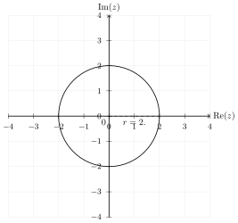

(math-hs:algebra:complex:problems)=
# Problemi - soluzioni

(math-hs:algebra:complex:problems:def)=
## Definizioni

(math-hs:algebra:complex:problems:complex-plane:sol)=
## Rappresentazione dei numeri complessi nel piano complesso (Argand-Gauss)

(math-hs:algebra:complex:problems:operations:sol)=
## Operazioni con i numeri complessi

Soluzione degli [esercizi sulle operazioni con i numeri complessi](math-hs:algebra:complex:problems:operations:cc:re-im).

(math-hs:algebra:complex:fund-thm:sol)=
## Teorema fondamentale dell'algebra

Soluzione degli [esercizi sul teorema fondmaentale dell'algebra](math-hs:algebra:complex:fund-thm:ex).

(math-hs:algebra:complex:problems:geometry-2d:sol)=
## Numeri complessi e geometria nel piano euclideo
Soluzione degli [esercizi sui numeri complessi e la geometria nel piano euclideo](math-hs:algebra:complex:problems:geometry-2d:ex).


(math-hs:algebra:complex:problems:equations:sol)=
## Equazioni e disequazioni con i numeri complessi

### Equazioni
Soluzione degli [esercizi su equazioni con i numeri complessi](math-hs:algebra:complex:problems:equations:sys)

````{only} html

**1.** Risolvere $|z| = 2$

```{dropdown} Soluzione

Esistono infinite soluzioni del problema, e sono tutti i numeri complessi con modulo $2$ e argomento arbitrario,

$$z = 2 e^{i \theta} \quad \forall \theta \in \mathbb{R} \ .$$

**Interpretazione grafica.** L'equazione corrisponde all'equazione di una circonferenza di raggio 2 centrata nell'origine. 


<!-- *Didascalia, se necessaria* -->

```

2. Trova i numeri complessi $z$ che soddisfano $z + \overline{z} = 2$.
3. Risolvi $z^2 - 2z + 5 = 0$ e calcola il modulo delle soluzioni.
4. Risolvi $|z - 3| = 5$ e rappresenta graficamente le soluzioni.
5. Trova i valori di $z$ per cui $z^3 = 27$.
6. Risolvi $z^4 + 16 = 0$ e rappresenta graficamente le soluzioni nel piano complesso.
7. Risolvi $|z - 1| = |z + 1|$ e descrivi il luogo geometrico delle soluzioni.
8. Trova le soluzioni di $z^5 - 32 = 0$ e rappresentale in forma polare.
9. Determina i numeri complessi $z$ per cui $|z|^2 + |z - 2|^2 = 8$.
10. Risolvi $|z + i| = 3$ per $z \in \mathbb{C}$.
11. $z^2 + 4 = 0$
12. $z^2 - 2z + 5 = 0$
13. $z^3 + 8 = 0$
14. $|z-2-i| = 2$
15. $|z-2-i| = |z-1|$
16. $z + \bar{z} = 1$

````

````{only} latex

**1.** Risolvere $|z| = 2$.

$$
\begin{minipage}[t]{.55\textwidth}
Esistono infinite soluzioni del problema, e sono tutti i numeri complessi con modulo $2$ e argomento arbitrario,
%
\begin{equation} z = 2 e^{i \theta} \quad \forall \theta \in \mathbb{R} \ .\end{equation}
%
\textbf{Interpretazione grafica.} L'equazione corrisponde all'equazione di una circonferenza di raggio 2 centrata nell'origine. 
\end{minipage}
\hspace{.05\textwidth}
\begin{minipage}[t]{.40\textwidth}
  \vspace{0pt}
  \includegraphics[width=.95\textwidth]{../../media/tikz/complex/ex-eq-01.pdf}
\end{minipage}
$$

**2.** Trova i numeri complessi $z$ che soddisfano $z + \overline{z} = 2$.

$$
\begin{minipage}[t]{.55\textwidth}
\begin{equation}2 \text{re}{z} = 2\end{equation}
\begin{equation}\text{re}{z}   = 1\end{equation}
\end{minipage}
\hspace{.05\textwidth}
\begin{minipage}[t]{.40\textwidth}
  \vspace{0pt}
  \includegraphics[width=.95\textwidth]{../../media/tikz/complex/ex-eq-02.pdf}
\end{minipage}
$$

**3.** Risolvi $z^2 - 2z + 5 = 0$ e calcola il modulo delle soluzioni.

$$
\begin{minipage}[t]{.55\textwidth}
%
Usando la formula risolutiva per le equazioni di secondo grado,
\begin{equation} 
z = 1 \mp \sqrt{1-5} = 1 \mp i 2 \end{equation}
%
**Verifica.**
%
\begin{equation}\begin{aligned}
z^2  & = (1 \mp i 2)^2 = -3 \mp i 4 \\
-2 z & = -2 ( 1 \mp i 2 ) \\
+ 5  & = 5 \\
\hline 
& = &  ( -3-2+5 ) + i(\mp 4 \pm 4) = 0 
\end{aligned}\end{equation}
%
\begin{equation}\text{re}{z}   = 1\end{equation}
\end{minipage}
\hspace{.05\textwidth}
\begin{minipage}[t]{.40\textwidth}
  \vspace{0pt}
  \includegraphics[width=.95\textwidth]{../../media/tikz/complex/ex-eq-03.pdf}
\end{minipage}
$$


**4.** Risolvi $|z - 3 + i| = 2$ e rappresenta graficamente le soluzioni.

$$
\begin{minipage}[t]{.55\textwidth}
...
\end{minipage}
\hspace{.05\textwidth}
\begin{minipage}[t]{.40\textwidth}
  \vspace{0pt}
  \includegraphics[width=.95\textwidth]{../../media/tikz/complex/ex-eq-04.pdf}
\end{minipage}
$$

**5.** Trova i valori di $z$ per cui $z^3 = 27$.

$$
\begin{minipage}[t]{.55\textwidth}
...
\end{minipage}
\hspace{.05\textwidth}
\begin{minipage}[t]{.40\textwidth}
  \vspace{0pt}
  \includegraphics[width=.95\textwidth]{../../media/tikz/complex/ex-eq-05.pdf}
\end{minipage}
$$

**6.** Risolvi $(z-1)^4 + 16 = 0$ e rappresenta graficamente le soluzioni nel piano complesso.

$$
\begin{minipage}[t]{.55\textwidth}
...
\end{minipage}
\hspace{.05\textwidth}
\begin{minipage}[t]{.40\textwidth}
  \vspace{0pt}
  \includegraphics[width=.95\textwidth]{../../media/tikz/complex/ex-eq-06.pdf}
\end{minipage}
$$

**7.** Risolvi $|z - 2| = |z + 1|$ e descrivi il luogo geometrico delle soluzioni.

$$
\begin{minipage}[t]{.55\textwidth}
...
\end{minipage}
\hspace{.05\textwidth}
\begin{minipage}[t]{.40\textwidth}
  \vspace{0pt}
  \includegraphics[width=.95\textwidth]{../../media/tikz/complex/ex-eq-07.pdf}
\end{minipage}
$$

**8.** Trova le soluzioni di $z^5 - 32 = 0$ e rappresentale in forma polare.

**9.** Determina i numeri complessi $z$ per cui $|z|^2 + |z - 2|^2 = 8$.

**10.** Risolvi $|z + i| = 3$ per $z \in \mathbb{C}$.

**11.** $z^2 + 4 = 0$

**12.** $z^2 - 2z + 5 = 0$

**13.** $z^3 + 8 = 0$

**14.** $|z-2-i| = 2$

**15.** $|z-2-i| = |z-1|$

**16.** $z + \bar{z} = 1$

````

### Disequazioni
Soluzione degli [esercizi su disequazioni con i numeri complessi](math-hs:algebra:complex:problems:equations:ineq)

```` {only} html
````

```` {only} latex
**1.** Trova i numeri complessi $z$ che soddisfano $|z| < 3$.

$$
\begin{minipage}[t]{.55\textwidth}
...
\end{minipage}
\hspace{.05\textwidth}
\begin{minipage}[t]{.40\textwidth}
  \vspace{0pt}
  \includegraphics[width=.95\textwidth]{../../media/tikz/complex/ex-in-01.pdf}
\end{minipage}
$$

**2.** Determina $z$ per cui $|z - 2| \geq 4$.

$$
\begin{minipage}[t]{.55\textwidth}
...
\end{minipage}
\hspace{.05\textwidth}
\begin{minipage}[t]{.40\textwidth}
  \vspace{0pt}
  \includegraphics[width=.95\textwidth]{../../media/tikz/complex/ex-in-02.pdf}
\end{minipage}
$$

**3.** Risolvi $|z + i| \leq 2$.

$$
\begin{minipage}[t]{.55\textwidth}
...
\end{minipage}
\hspace{.05\textwidth}
\begin{minipage}[t]{.40\textwidth}
  \vspace{0pt}
  \includegraphics[width=.95\textwidth]{../../media/tikz/complex/ex-in-03.pdf}
\end{minipage}
$$

**4.** Trova $z$ tali che $\text{Re}(z) > \text{Im}(z)$.

$$
\begin{minipage}[t]{.55\textwidth}
...
\end{minipage}
\hspace{.05\textwidth}
\begin{minipage}[t]{.40\textwidth}
  \vspace{0pt}
  \includegraphics[width=.95\textwidth]{../../media/tikz/complex/ex-in-04.pdf}
\end{minipage}
$$

**5.** Risolvi $|z - 1| > |z + 1|$.

$$
\begin{minipage}[t]{.55\textwidth}
...
\end{minipage}
\hspace{.05\textwidth}
\begin{minipage}[t]{.40\textwidth}
  \vspace{0pt}
  \includegraphics[width=.95\textwidth]{../../media/tikz/complex/ex-in-05.pdf}
\end{minipage}
$$

**6.** Determina il luogo geometrico di $z$ per cui $|z| - |z-2| \leq 1$.

$$
\begin{minipage}[t]{.55\textwidth}
La condizione corrisponde alla ricerca dei punti del piano in una zona del piano delimitata da un ramo dell'iperbole con fuochi $F_1 \equiv (0,0)$, $F_2(2,0)$ e con differenza delle distanze $2 a = 1$. La distanza dei due fuochi è $2c = 2$. I coefficienti che definiscono l'iperbole sono quindi
%
\begin{equation}
  a = \frac{1}{2} \ , \quad c = 1 \ , \quad b = \sqrt{c^2-a^2} = \frac{\sqrt{3}}{2} \ ,
\end{equation}
%
il centro è $C \equiv \left(1,0 \right)$ e l'eccentricità $e = \frac{c}{a} = 2 > 1$.
%
Le coordinate dei punti dell'iperbole possono essere scritte in forma parametrica come
%
\begin{equation} P - C = \hat{x} a \cosh \theta + \hat{y} b \sinh \theta \end{equation}
%
o usando i numeri complessi,
%
\begin{equation} z(\theta) = 1 + a \cosh \theta + i b \sinh \theta \end{equation}
%
\end{minipage}
\hspace{.05\textwidth}
\begin{minipage}[t]{.40\textwidth}
  \vspace{0pt}
  \includegraphics[width=.95\textwidth]{../../media/tikz/complex/ex-in-06.pdf}
\end{minipage}
$$

**7.** Risolvi $\text{Re}(z) + \text{Im}(z) \leq 2$.

$$
\begin{minipage}[t]{.55\textwidth}
...
\end{minipage}
\hspace{.05\textwidth}
\begin{minipage}[t]{.40\textwidth}
  \vspace{0pt}
  \includegraphics[width=.95\textwidth]{../../media/tikz/complex/ex-in-07.pdf}
\end{minipage}
$$

**8.** Trova $z$ tali che $|z| + |z - 1| \leq 5$.

$$
\begin{minipage}[t]{.55\textwidth}
La condizione corrisponde alla ricerca dei punti del piano contenuti nella regione delimitata dall'ellisse con fuochi $F_1 \equiv (0,0)$, $F_2(1,0)$ e con somma delle distanze $2 a = 5$. La distanza dei due fuochi è $2c = 1$. I coefficienti che definiscono l'ellisse sono quindi
%
\begin{equation}
  a = \frac{5}{2} \ , \quad c = \frac{1}{2} \ , \quad b = \sqrt{a^2-c^2} = \frac{\sqrt{24}}{2} = \sqrt{6}
\end{equation}
%
il centro è $C \equiv \left(\frac{1}{2},0 \right)$ e l'eccentricità $e = \frac{c}{a} = \frac{1}{5}$.
%
Le coordinate dei punti dell'ellisse possono essere scritte in forma parametrica come
%
\begin{equation} P - C = \hat{x} a \cos \theta + \hat{y} b \sin \theta \end{equation}
%
o usando i numeri complessi,
%
\begin{equation} z(\theta) = \frac{1}{2} + a \cos \theta + i b \sin \theta \end{equation}
%
\end{minipage}
\hspace{.05\textwidth}
\begin{minipage}[t]{.40\textwidth}
  \vspace{0pt}
  \includegraphics[width=.95\textwidth]{../../media/tikz/complex/ex-in-08.pdf}
\end{minipage}
$$

**9.** Trova $z$ tali che $|z+i| + |z - 1| \leq 5$.

$$
\begin{minipage}[t]{.55\textwidth}
La condizione corrisponde alla ricerca dei punti del piano contenuti nella regione delimitata dall'ellisse con fuochi $F_1 \equiv (0,-1)$, $F_2(1,0)$ e con somma delle distanze $2 a = 5$. La distanza dei due fuochi è $2c = \sqrt{2}$. I coefficienti che definiscono l'ellisse sono quindi
%
\begin{equation}
  a = \frac{5}{2} \ , \quad c = \frac{\sqrt{2}}{2} \ , \quad b = \sqrt{a^2-c^2} = \frac{\sqrt{23}}{2} 
\end{equation}
%
il centro è $C \equiv \left(\frac{1}{2}, -\frac{1}{2} \right)$ e l'eccentricità $e = \frac{c}{a} = \frac{\sqrt{2}}{5}$.
%
Le coordinate dei punti dell'ellisse possono essere scritte in forma parametrica come
%
\begin{equation} P - C = \hat{x} a \cos \theta + \hat{y} b \sin \theta \end{equation}
%
o usando i numeri complessi,
%
\begin{equation} z(\theta) = \frac{1}{2} + a \cos \theta + i \left[ - \frac{1}{2} + b \sin \theta \right] \end{equation}
%
%
\end{minipage}
\hspace{.05\textwidth}
\begin{minipage}[t]{.40\textwidth}
  \vspace{0pt}
  \includegraphics[width=.95\textwidth]{../../media/tikz/complex/ex-in-09.pdf}
\end{minipage}
$$

**10.** Risolvi $|z - i| \geq |z + 2|$.

$$
\begin{minipage}[t]{.55\textwidth}
...
\end{minipage}
\hspace{.05\textwidth}
\begin{minipage}[t]{.40\textwidth}
  \vspace{0pt}
  \includegraphics[width=.95\textwidth]{../../media/tikz/complex/ex-in-10.pdf}
\end{minipage}
$$

**11.** Determina il luogo geometrico di $z$ per cui $|z| - |z-2| \leq 3$.

Si riorganizza l'equazione per confrontare due termini non-negativi,

$$
  |z| \leq 3 + |z-2| \ .
$$

Usando una rappresentazione cartesiana, $z = x + i y$,

$$\begin{aligned}
  & x^2 + y^2 \leq 9 + (x-2)^2 + y^2 + 6\sqrt{(x-2)^2+y^2} \\
  & x^2 + y^2 \leq 9 + x^2 - 4x + 4 + y^2 + 6\sqrt{(x-2)^2+y^2} \\
  & 4x - 13   \leq 6\sqrt{(x-2)^2+y^2} \\
\end{aligned}$$

Ora, si osserva che il termine di destra è non-negativo per ogni valore di $x$, $y$. Il termine di sinistra può avere segno positivo o negativo. Si discutono quindi i due casi:
- $4x - 13 \leq 0$: la disequazione è sempre soddisfatta poiché il termine di sinistra è non-positivo, il termine di destra è non-negativo e deve essere maggiore *o uguale* al termine di sinitra. Questo è quindi sempre vero, nel caso in cui $4 x - 13 \leq 0$
- $4x - 13 > 0$: in questo caso entrambi i termini sono non negativi, e quindi si può elevare al quadrato per "eliminare" la radice quadrata.

  $$\begin{aligned}
    & 16x^2 - 104 x + 169 \leq 36 x^2 - 144 x + 144 + 36 y^2 \\
    & 0 \leq 20 x^2 - 40 x - 25 + 36 y^2 \\
    & 0 \leq 20 ( x^2 - 2 x + 1 ) - 45 + 36 y^2 \\
    &  \frac{(x-1)^2}{\frac{45}{20}} + \frac{y^2}{\frac{45}{36}} \geq 1 \ ,
  \end{aligned}$$
  
  e questa disequazione è soddisfatta per tutti i punti esterni all'ellisse con centro $(1,0)$ e semi-assi 

  $$\begin{aligned}
    a & = \sqrt{\frac{45}{20}} = \sqrt{\frac{9}{4}} = \frac{3}{2} \\
    b & = \sqrt{\frac{45}{36}} = \sqrt{\frac{5}{4}} = \frac{\sqrt{5}}{2} \\
  \end{aligned}$$

  Il punto con parte reale minima per la quale la disequazione smette di essere soddisfatta è il punto estremo sul semiasse maggiore, $z = z_c + a = 1 + \frac{3}{2} = \frac{5}{2}$. Questo numero è minore di $\frac{13}{4}$, valore limite di $x$ di questo secondo caso. Quindi la disequazione è sempre soddisfatta per tutti gli $x > \frac{13}{4}$.

La disequazione risulta quindi soddisfatta sempre in entrambi i casi, e quindi risulta sempre soddisfatta in tutto il piano complesso, cioè vale $\forall z \in \mathbb{C}$.

$$
\begin{minipage}[t]{.45\textwidth}
  \vspace{0pt}
  \includegraphics[width=.95\textwidth]{../../media/tikz/complex/ex-in-11.pdf}
\end{minipage}
\hspace{.05\textwidth}
\begin{minipage}[t]{.45\textwidth}
  \vspace{0pt}
  \includegraphics[width=.95\textwidth]{../../media/tikz/complex/ex-in-11-a.pdf}
\end{minipage}
$$

````

### Sistemi
Soluzione degli [esercizi su sistemi di equazioni con i numeri complessi](math-hs:algebra:complex:problems:equations:sys)

````{only} html
**1.** Risolvere $\begin{cases} z + \bar{z} = 6 \\ |z| = 5 \end{cases}$

```{dropdown} Soluzione

La prima equazione si riduce a $2 \text{re}\{z\} = 6$. Usando la rappresentazione cartesiana, $z = x + i y$, il sistema può essere riscritto come

$$\begin{cases}
  x = 3 \\
  \sqrt{x^2 +y^2} = 5
\end{cases}$$

Sostituendo la prima nella seconda si trova $\sqrt{9 + y^2} = 5$; elevando al quadrato i due numeri positivi, $y^2 = 25-9=16$ e quindi $y = \mp 4$. Il problema ha quindi due soluzioni

$$\begin{aligned}
  z_1 & = 3 - i 4 \\
  z_2 & = 3 + i 4
\end{aligned}$$

**Interpretazione grafica.** Le due equazioni corrispondono all'equazione della retta di equazione $x = 3$ e della circonferenza centrata nell'origine di raggio $5$. La soluzione del sistema coincide con la ricerca dei punti di intersezione di queste due curve.


<!-- *Didascalia, se necessaria* -->

```

**2.** Trova $z_1$ e $z_2$ che soddisfano il sistema:  
   $\begin{cases} 
   |z_1| = 3 \\
   z_1 z_2 = 9 
   \end{cases}$

```{dropdown} Soluzione
```

**3.** Risolvi il sistema:  
   $\begin{cases} 
   z^2 + w^2 = 5 \\
   z w = 4 
   \end{cases}$

```{dropdown} Soluzione
```

**4.** Determina le soluzioni del sistema:  
   $\begin{cases} 
   |z| = 4 \\
   z + \overline{z} = 6 
   \end{cases}$

```{dropdown} Soluzione
```

**5.** Risolvi il sistema:  
   $\begin{cases} 
   z^3 + w = 1 \\
   z w^3 = -1 
   \end{cases}$

```{dropdown} Soluzione
```

**6.** Trova $z$ e $w$ per il sistema:  
   $\begin{cases} 
   z^2 + w^2 = 7 \\
   z + w = 3 
   \end{cases}$

```{dropdown} Soluzione
```

**7.** Risolvi il sistema:  
   $\begin{cases} 
   |z| = 2 \\
   z + w = 0 
   \end{cases}$

```{dropdown} Soluzione
```

**8.** Trova $z$ e $w$ che soddisfano il sistema:  
   $\begin{cases} 
   z w = 1 \\
   z - w = i 
   \end{cases}$

```{dropdown} Soluzione
```

**9.** Determina le soluzioni del sistema:  
   $\begin{cases} 
   z^2 + \overline{z}^2 = 8 \\
   z \cdot \overline{z} = 9 
   \end{cases}$

```{dropdown} Soluzione
```

**10.** Risolvi il sistema:  
    $\begin{cases} 
    z + w = 5 + i \\
    z \cdot w = 6 - i 
    \end{cases}$

```{dropdown} Soluzione
```

````

````{only} latex

**1.** Risolvere $\begin{cases} z + z^* = 6 \\ |z| = 5 \end{cases}$

$$
\begin{minipage}[t]{.55\textwidth}
  \vspace{0pt}
La prima equazione si riduce a $2 \text{re}\{z\} = 6$. Usando la rappresentazione cartesiana, $z = x + i y$, il sistema può essere riscritto come
%
\begin{equation}\begin{cases}
  x = 3 \\
  \sqrt{x^2 +y^2} = 5
\end{cases}\end{equation}
%
Sostituendo la prima nella seconda si trova $\sqrt{9 + y^2} = 5$; elevando al quadrato i due numeri positivi, $y^2 = 25-9=16$ e quindi $y = \mp 4$. Il problema ha quindi due soluzioni
%
\begin{equation}\begin{aligned}
  z_1 & = 3 - i 4 \\
  z_2 & = 3 + i 4
\end{aligned}\end{equation}
%
\textbf{Interpretazione grafica.} Le due equazioni corrispondono all'equazione della retta di equazione $x = 3$ e della circonferenza centrata nell'origine di raggio $5$. La soluzione del sistema coincide con la ricerca dei punti di intersezione di queste due curve.
%
\end{minipage}
\hspace{.05\textwidth} %
\begin{minipage}[t]{.40\textwidth}
  \vspace{0pt}
  \includegraphics[width=.95\textwidth]{../../media/tikz/complex/ex-sy-01.pdf}
\end{minipage}
$$

**2.** Trova $z_1$ e $z_2$ che soddisfano il sistema:  
   $\begin{cases} 
   |z_1| = 3 \\
   z_1 z_2 = 9 
   \end{cases}$

**3.** Risolvi il sistema:  
   $\begin{cases} 
   z^2 + w^2 = 5 \\
   z w = 4 
   \end{cases}$

**4.** Determina le soluzioni del sistema:  
   $\begin{cases} 
   |z| = 4 \\
   z + \overline{z} = 6 
   \end{cases}$

**5.** Risolvi il sistema:  
   $\begin{cases} 
   z^3 + w = 1 \\
   z w^3 = -1 
   \end{cases}$

**6.** Trova $z$ e $w$ per il sistema:  
   $\begin{cases} 
   z^2 + w^2 = 7 \\
   z + w = 3 
   \end{cases}$

**7.** Risolvi il sistema:  
   $\begin{cases} 
   |z| = 2 \\
   z + w = 0 
   \end{cases}$

**8.** Trova $z$ e $w$ che soddisfano il sistema:  
   $\begin{cases} 
   z w = 1 \\
   z - w = i 
   \end{cases}$

**9.** Determina le soluzioni del sistema:  
   $\begin{cases} 
   z^2 + \overline{z}^2 = 8 \\
   z \cdot \overline{z} = 9 
   \end{cases}$

**10.** Risolvi il sistema:  
    $\begin{cases} 
    z + w = 5 + i \\
    z \cdot w = 6 - i 
    \end{cases}$

````
