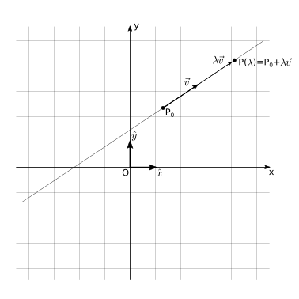
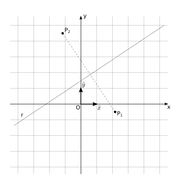
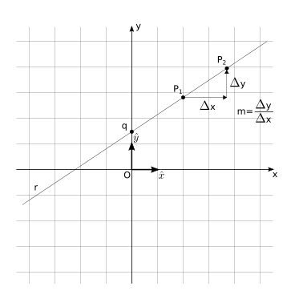

(geometry:analytic:2d:lines)=
# Rette nel piano

Per Euclide, il concetto di retta è un ente geometrico fondamentale della geometria, che rappresenta il percorso "più diretto" tra due punti distinti. Ad esempio, è l'idealizzazione di spessore nullo e di lunghezza infinita, prolungata oltre gli estremi, del segmento che si otterrebbe in un'esperienza comune tendendo un filo di lana tra due punti nello spazio senza ostacoli.

Per trovare l'equazione di una retta, si possono usare delle definizione equivalenti.

## Definizioni ed equazione

```{list-table}
:header-rows: 0
* - 
  - 
  - 
```

**Definizione. 1 - Passaggio per un punto e direzione.** Usando gli strumenti dell'algebra vettoriale in uno spazio euclideo, i punti di una retta passante per un punto $P_0$ con direzione identificata dal vettore $\vec{v}$ possono essere rappresentati dall'**equazione parametrica**,

  $$P = P_0 + \lambda \overrightarrow{v} \ .$$

  Questa relazione può essere riscritta usando un sistema di coordinate cartesiane, con vettori della base $\{ \hat{x}, \hat{y}\}$

  $$r: \begin{cases}
    x_P(\lambda) = x_{P_0} + \lambda \ v_x \\
    y_P(\lambda) = y_{P_0} + \lambda \ v_y \ ,
   \end{cases}
  $$

  avendo indicato con $(x_P, y_P)$ le coordinate cartesiane di un punto generico $P$ della retta, con $(x_{P_0}, y_{P_0})$ le coordinate del punto $P_0$ e con $v_x$, $v_y$ le componenti cartesiane del vettore euclide $\vec{v} = v_x \hat{x} + v_y \hat{y}$, riferite al sistema di coorinate cartesiano scelto.

**Definizione 2 - Luogo dei punti equidistante da due punti distinti dati.** Una retta è il luogo geometrico dei punti $P$ equidistanti da due punti distinti nel piano, $P_1$, $P_2$,

$$|P - P_1| = |P-P_2|$$

Usando un sistema di coordinate cartesiane per identificare i punti, $P_1 \equiv (x_1, y_1)$, $P_2 \equiv (x_2, y_2)$, $P \equiv (x,y)$ per calcolare (il quadrato del)le distanze, 

$$\begin{aligned}
 (x - x_1)^2 + (y - y_1)^2 &=  (x - x_2)^2 + (y - y_2)^2 \\
 x^2 - 2 x x_1 + x_1^2 + y^2 - 2 y y_1 + y_1^2 &=  x^2 - 2 x x_2 + x_2^2 + y^2 - 2 y y_2 + y_2^2 \\
\end{aligned}$$

semplificando i termini $x^2$, $y^2$, e raccogliendo mettendo in evidenza le coordinate $x$, $y$, si ottiene una rappresentazione implicita della retta,

$$  2 ( x_2 - x_1 ) x + 2 ( y_2 - y_1 ) y - x_1^2 - y_1^2 - x_2^2 - y_2^2 = 0 \ ,$$

che può essere riscritta in generale nella **forma esplicita**,

$$a \, x + b \, y + c = 0 \ ,$$

con ovvio significato dei coefficienti $a$, $b$, $c$, e $a$, $b$ non contemporanemante nulli (altrimenti rimarrebbe l'identità $0 = 0$, corrispondente alla condizione $a = x_2 - x_1 = 0$, $b = y_2 - y_1 = 0$, corrispondente ai due punti $P_1 \equiv P_2$ coinvidenti).

**Casi particolari: rette paralleli agli assi.** Una retta parallela all'asse $x$ ha l'espressione $b \, y + c = 0$, con $a = 0$; una retta parallela all'asse $y$ ha l'espressione $a \, x + c = 0$, con $b=0$.

**Definizione 3 - intercetta con asse $\ y$ e pendenza.** Una retta può essere definita tramite il suo punto di intersezione  con l'asse $y$ e la sua pendenza, intesa come il rapporto tra le coordinate di due suoi punti, $m := \frac{\Delta y}{\Delta x}$, **se la retta non è parallela all'asse $y$**.

Se la retta **non è parallela all'asse $y$** rappresenta il grafico di una funzione (**todo** aggiungere riferimento), il coefficiente $b \ne 0$, e si può esplicitare la coordinata $y$ partendo dall'equazione in forma implicita,

$$y = -\frac{a}{b} x - \frac{c}{b} = m \, x + q \ ,$$

per ottenere l'equazione della retta in **forma esplicita**.


## Posizioni reciproche
### Posizione reciproca di punto e retta
Un punto $P$ o appartiene o non appartiene a una retta $r$. Se appartiene alla curva, la distanza tra punto e retta è nulla; se non appartiene alla curva, la distanza tra punto e retta è positiva e può essere calcolata come mostrato nella sezione [](geometry:analytic:2d:lines:distance-point-line).

**Punto appartenente alla retta.** Una retta $r$ passa per un punto $P$ assegnato se le coordinate del punto $P$ soddisfano le equazioni che descrivono la retta.


### Posizione reciproca di rette

Due rette nel piano possono essere:
- coincidenti: hanno tutti i punti in comune
- parallele: non hanno nessun punto in comune
- incidenti: si intersecano e la loro intersezione è un punto

#### Rette coincidenti
Due rette sono coincidenti se hanno un punto in comune e hanno la stessa direzione. In geometria analitica, due rette sono coincidenti se sono rappresentate dalla stessa equazione.

Usando la forma parametrica, due rette sono coincidenti se è possibile scrivere le loro equazioni

$$\begin{aligned}
  r_1: \ P_1(\lambda_1) = P_{1,0} + \lambda_1 \ \vec{v}_1 \\
  r_2: \ P_2(\lambda_2) = P_{2,0} + \lambda_2 \ \vec{v}_2
\end{aligned}$$

con

$$\begin{cases}
   P_{1,0} = P_{2,0} & \text{(punto in comune)} \\
   \vec{v}_1 \propto \vec{v}_2 & \text{(stessa direzione)}
\end{cases}$$ 

Usando la forma esplicita, due rette coincidenti (non paralleli all'asse $y$) hanno la stessa intersezione con l'asse $y$ e la stessa pendenza

$$\begin{cases}
  q_1 = q_2 & \text{(interesezione con asse $y$ in comune)} \\
  m_1 = m_2 & \text{(stessa pendenza/direzione)}
\end{cases}$$

Usando la forma implicita, due rette sono coincienti se i coefficienti di una retta sono multipli dei coefficienti dell'altra retta,

$$r_2: 0 = \ a_2 \, x + b_2 \, y + c_2 = \alpha (a_1 \, x + b_1 \, y + c_1) \ , $$

in modo tale da rappresentare la stessa equazione, per $\alpha = 0$.

#### Rette parallele nel piano
Due rette sono parallele se hanno la stessa direzione. Questa condizione può essere definita usando l'equazione parametrica delle rette,

$$\vec{v}_1 \propto \vec{v}_2 \ ,$$

usando l'equazione in forma implicita,

$$\frac{a_1}{b_1} = \frac{a_2}{b_2} \ , \text{(con $b_i \ne 0$...)}$$

o usando l'equazione in forma esplicita,

$$m_1 = m_2 \ .$$

#### Rette incidenti
Nel piano, se due rette non sono parallele allora sono incidenti, cioè hanno un punto in comune.

#### Rette incidenti perpendicolari
In geometria euclidea, due rette sono perpendicolari tra di loro se dividono il piano comune nel quale giacciono in 4 angoli retti. Questa condizione può essere definita usando l'equazione delle rette in forma parametrica, 

$$\vec{v}_1 \cdot \vec{v}_2 = 0 \ ,$$

ricordandosi le proprietà del [prodotto interno in spazi euclidei](math-hs:algebra:vector:euclidean-space:inner-product), e che $\cos \frac{\pi}{2} = 0$.
Usando l'equazione in forma implicita,

$$a_2 \, b_1 = - a_1 \, b_2 \ ,$$

o usando l'equazione in forma esplicita (nel caso le due rette non siano parallele a un asse),

$$m_2 = -\frac{1}{m_1}$$

(geometry:analytic:2d:lines:distance-point-line)=
## Distanza punto-retta
La distanza di un punto $Q$ da una retta $r: \, P(\lambda) =  P_0 + \lambda \vec{v}$ può essere calcolato in diverse maniere:
- calcolando il valore minimo della distanza tra il punto $Q$ dato e i punti $P(\lambda)$ della retta

  $$\min_{P \in r} |Q - P|$$

- trovando la retta $r_{\perp}$ perpendicolare a $r$ e passante per $Q$; trovando il punto $P^*$ intersezione tra le due rette $r$, $r_{\perp}$, $P^* = r \cap r_{\perp}$; calcolando la distanza punto-punto tra $Q$ e $P^*$

  $$ \dots \text{**todo** o lasciare come esercizio}$$

- usando il [prodotto vettoriale](math-hs:algebra:vector:euclidean-space:inner-product) tra il vettore $\vec{v}$ e il vettore $Q-P_0$

  $$d = \frac{|\vec{v} \times (Q-P)|}{|\vec{v}|} = |Q - P| \sin \theta \ .$$

