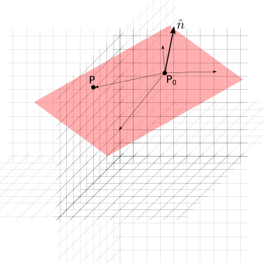
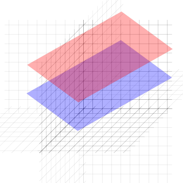
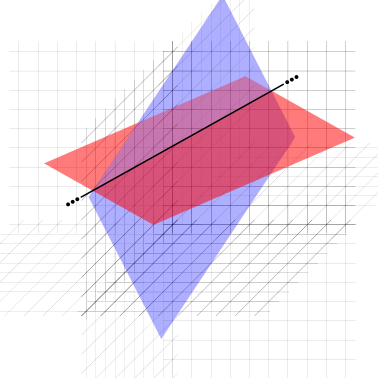

(geometry:analytic:3d:planes)=
# Piani nello spazio

Per Euclide, il concetto di piano è un ente geometrico fondamentale della geometria. In geometria analitica, per trovare l'equazione di un piano si possono usare diverse definizioni equivalenti.

(geometry:analytic:3d:planes:def)=
## Definizioni ed equazione

**Definizione 1 - Passaggio per un punto e direzione normale.**
Un piano $\pi$ può essere definito come il luogo dei punti $P$ dello spazio che formano un vettore $(P-Q)$ con un punto dato $Q$ ortogonali a un vettore $\overrightarrow{n}$ che indica la direzione normale al piano $\pi$. Usando le proprietà del prodotto scalare,

$$(P-Q) \cdot \overrightarrow{n} = 0 \ .$$

Usando un sistema di coordinate cartesiane, si può trovare l'equazione implicita del piano $\pi$,

$$\pi: \ (x - x_Q) n_x + (y - y_Q) n_y + (z - z_Q) n_z = 0 \ .$$ (eq:geometry:analytic:3d:planes:def-1)

**Osservazione.** L'equazione implicita del piano è independente dal modulo del vettore $\vec{n}$, poiché rappresenterebbe un ininfluente fattore moltiplicativo (diverso da zero) nel termine di sinistra quando uguagliato a zero.


**Definizione 2. - Passaggio per un punto e direzioni tangenti.**
Partendo dalla prima definizione, si possono ricavare le equazioni parametriche del piano. Dato il vettore $\vec{n}$, si possono trovare due vettori $\vec{t}_1$, $\vec{t}_2$ a esso ortogonali,

$$\vec{t}_1 \cdot \vec{n} = \vec{t}_2 \cdot \vec{n} = 0 \ .$$

Se i due vettori non sono tra di loro allineati, o meglio proporzionali, è possibile descrivere tutti i punti del piano come una loro combinazione lineare

$$\pi: \ P = Q + \lambda_1 \vec{t}_1 + \lambda_2 \vec{t}_2 \ .$$


**Definizione 3. - Luogo dei punti equidistante da due punti distinti dati.** Il luogo dei punti P dello spazio equidistanti da due punti $P_1$, $P_2$ dati è il piano identificato dalla condizione

$$|P - P_1| = | P - P_2 | \ .$$

Usando un sistema di coordinate cartesiane per identificare i due punti $P_1 \equiv (x_1,y_1,z_1)$, $P_2 \equiv (x_2,y_2,z_2)$, per calcolare (il quadrato del)le distanze,

$$\begin{aligned}
 (x - x_1)^2 + (y - y_1)^2 + (z - z_1)^2 &=  (x - x_2)^2 + (y - y_2)^2 + (z - z_2)^2 \\
 x^2 - 2 x x_1 + x_1^2 + y^2 - 2 y y_1 + y_1^2 + z^2 - 2 z z_1 + z_1^2 &=  x^2 - 2 x x_2 + x_2^2 + y^2 - 2 y y_2 + y_2^2 + z^2 - 2 z z_2 + z_2^2 \\
\end{aligned}$$

semplificando i termini $x^2$, $y^2$, $z^2$ e raccogliendo mettendo in evidenza le coordinate $x$, $y$, $z$, si ottiene una rappresentazione implicita della retta,

$$  2 ( x_2 - x_1 ) x + 2 ( y_2 - y_1 ) y + 2 ( z_2 - z_1 ) z - x_1^2 - y_1^2 - z_1^2 - x_2^2 - y_2^2 - z_2^2 = 0 \ ,$$ (eq:geometry:analytic:3d:planes:def-3-1)

che può essere riscritta in generale nella **forma esplicita**,

$$a \, x + b \, y + c \, z + d = 0 \ ,$$ (eq:geometry:analytic:3d:planes:def-3-2)

con ovvio significato dei coefficienti $a$, $b$, $c$, $d$, e $a$, $b$, $c$ non contemporanemante nulli (altrimenti rimarrebbe l'identità $0 = 0$, corrispondente alla condizione $a = x_2 - x_1 = 0$, $b = y_2 - y_1 = 0$, $c = z_2 - z_1 = 0$ corrispondente ai due punti $P_1 \equiv P_2$ coinvidenti).

**Osservazione.** Confrontando le espressioni {eq}`eq:geometry:analytic:3d:planes:def-3-1`, {eq}`eq:geometry:analytic:3d:planes:def-3-2` con l'espressione {eq}`eq:geometry:analytic:3d:planes:def-1` della prima definizione, si può riconoscere che il vettore che congiunge i due punti $P_2 - P_1 = (x_2 - x_1) \hat{x} + (y_2 - y_1) \hat{y} + (z_2 - z_1)$ \hat{z} è allineato al vettore $\vec{n}$ e ortogonale al piano $\pi$, e al vettore $a \hat{x} + b \hat{y} + c \hat{z}$.

## Posizioni reciproche
### Posizione reciproca di punto e piano

Un punto $P$ o appartiene o non appartiene a un piano $\pi: \ \hat{n} \cdot (P - Q) = 0$. Se appartiene al piano, la distanza tra punto e retta è nulla; se non appartiene al piano, la distanza tra punto e piano può essere calcolata usando le proprietà
del [prodotto interno in spazi euclidei](math-hs:algebra:vector:euclidean-space:inner-product),

$$\text{dist}(A,\pi) = \left| \hat{n} \cdot (A-Q) \right| = |A-Q| \cos \theta \ .$$

**todo** *figura*

### Posizione reciproca di piani

Due piani nello spazio euclideo tridimensionale possono essere:
- coincidenti: hanno tutti i punti in comune
- paralleli: non hanno nessun punto in comune
- incidenti: si intersecano e la loro intersezione definisce una retta

```{list-table}
:header-rows: 0
* - 
  - 
  - 
```

<!--
## Distanza punto-piano
Dato un punto $A$ e un piano $\pi$, di cui sono noti un punto $Q$ e il vettore normale $\vec{n}$, la distanza di $A$ da $\pi$ può essere calcolata come il valore assoluto della proiezione del vettore $A-Q$ lungo la direzione normale al piano, individuata da $\vec{n}$,

avendo usato il vettore unitario $\hat{n} = \frac{\vec{n}}{|\vec{n}|}$ per la proiezione.
-->

