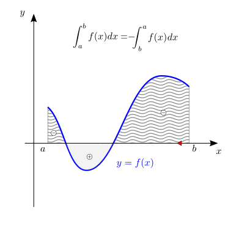
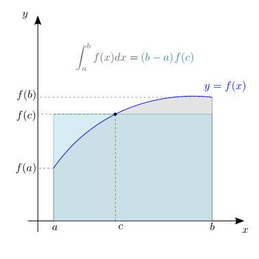

(infinitesimal-calculus:integrals)=
# Integrali

(infinitesimal-calculus:integrals:def)=
## Definizioni

```{prf:definition} Somma di Riemann
:label: infinitesimal-calculus:integrals:def:riemann-sum

 Data una funzione continua $f: [a,b] \rightarrow \mathbb{R}$ e $P = \{ x_0, x_1, \dots x_n | a = x_0 < x_1 < \dots < x_n = b \}$ partizione dell'intervallo $[a,b]$, la somma di Riemann viene definita come

$$\sigma_P = \sum_{k=1}^{n} f(\xi_k) (x_{k} - x_{k-1}) \ ,$$ (infinitesimal-calculus:integrals:riemann:sum)

con $\xi_k \in [x_{k-1}, x_k]$.
```

```{prf:definition} Integrale di Riemann
:label: infinitesimal-calculus:integrals:def:riemann-integral
Sia $\Delta x = \max_k (x_{k} - x_{k-1})$, l'integrale definito di Riemann è  il limite per $\Delta x \rightarrow 0$ della somma di Riemann $\sigma$

$$\int_a^b f(x) \ dx = \lim_{\Delta x \rightarrow 0} \sigma_P \ .$$ (infinitesimal-calculus:integrals:riemann:def)

```

**Osservazione.** Dato l'intervallo $[a,b]$, per $\Delta x \rightarrow 0$ il numero di intervalli della partizione tende all'infinito, $n \rightarrow \infty$.

```{list-table}
:header-rows: 0
* - 
  - 
  - 
```

### Interpretazione geometrica
L'integrale definito 

$$\int_{a}^{b} f(x) \, dx \ ,$$

corrisponde al valore dell'**area con segno** tra il grafico della funzione $y=f(x)$ e l'asse $x$, per valori di $x \in [a,b]$. Se la funzione è positiva in un intervallo, il contributo dell'integrale sull'intervallo è positivo; se la funzione è negativa in un intervallo, il contributo dell'integrale sull'intervallo è negativo.

(infinitesimal-calculus:integrals:def:definite)=
### Integrale definito

(infinitesimal-calculus:integrals:def:definite:prop)=
#### Proprietà dell'integrale definito

Dalla definizione {eq}`infinitesimal-calculus:integrals:riemann:def` dell'integrale di Riemann seguono immediatamente le seguenti proprietà:

- linearità dell'integrale definito

$$\int_a^b \big( \alpha f(x) + \beta g(x) \big) \ dx = \alpha \int_a^b f(x) \ dx + \beta \int_a^b g(x) \ dx \ ,$$ (infinitesimal-calculus:integrals:prop:linearity)

- additività sull'intervallo

$$\int_a^b f(x) \ dx + \int_b^c f(x) \ dx = \int_a^c f(x) \ dx \ ,$$ (infinitesimal-calculus:integrals:prop:add)

- valore assoluto dell'integrale è minore dell'integrale del valore assoluto

$$\left| \int_a^b f(x) \ dx \right| \le \int_a^b | f(x) | \ dx \ ,$$ (infinitesimal-calculus:integrals:prop:abs)

- scambio degli estremi di integrazione

$$\int_{x=a}^{b} f(x) dx = - \int_{x=b}^{a} f(x) \, dx$$ (infinitesimal-calculus:integrals:prop:swap)

```{list-table}
:header-rows: 0
* - 
  - 
* - 
  - 
```

(infinitesimal-calculus:integrals:def:indefinite)=
### Integrale indefinito
Usando la proprietà {eq}`infinitesimal-calculus:integrals:prop:add` di additività sull'intervallo dell'integrale definito,

$$\int_a^x f(t) \ dt = \int_a^b f(t) \ dt + \int_b^x f(t) \ dt \ , $$

si osserva che i due integrali con estremo superiore $x$ e diverso estremo inferiore differiscono solo per una quantità indipendente da $x$, $\int_{a}^{b} f(t) \ dt$. Data la funzione $f(x)$ e il valore $a$ come paramtetro, si definisce una funzione di $x$ 

$$F(x;a) := \int_a^x f(t) \ dt \ .$$ (infinitesimal-calculus:integrals:primi    )

Usando questa definizione, è immediato dimostrare che l'integrale definito $\int_{a}^{b} f(t) \ dt$ è uguale alla differenza della funzione $F(\cdot; b)$ calcolata nei due estremi,

$$\begin{aligned}
  \int_{a}^{b} f(t) \ dt & = \int_{c}^{b} f(t) dt + \int_{a}^{c} f(t) dt = \\ 
                         & = \int_{c}^{b} f(t) dt - \int_{c}^{a} f(t) dt = \\
                         & = F(b;c) - F(a;c) \ ,
\end{aligned}$$

e che questo risultato è indipendente dal valore $c$, usato come parametro nella definizione della funzione $F$. 

Data una funzione $f(x)$, le due funzioni $F(x;a_1)$, $F(x;a_2)$ differiscono solo di un termine che dipende dai parametri $a_1$, $a_2$ ma non dalla variabile indipendente $x$. La famiglia di funzioni $F(x;a)$ ottenuta per ogni valore di $a$ definisce quindi una funzione $F(x)$ a meno di una costante additiva, la **funzione primitiva** della funzione $f(x)$.

L'**integrale indefinito** di una funzione $f(x)$ viene definito come,

$$\int^x f(t) \ dt = F(x) + C \ ,$$

dove la costante additiva $C$ tiene conto dell'arbitrarietà appena discussa.


(infinitesimal-calculus:integrals:thm)=
## Teoremi

<!--
(infinitesimal-calculus:derivatives:thm:avg)=
### Teorema della media
:label: infinitesimal-calculus:derivatives:thm:avg
-->
(infinitesimal-calculus:integrals:thm:avg)=
### Teorema della media
```{prf:theorem} Teorema della media
:label: integrals:thm:avg

Sia $f: [a,b] \in \mathbb{R} \rightarrow \mathbb{R}$ una funzione continua su $[a,b]$, allora esiste $c \in [a,b]$ tale che

$$\int_{a}^{b} f(x) dx = (b-a) f(c) $$
```

```{dropdown} Dimostrazione
**todo**
```

<!--
(infinitesimal-calculus:derivatives:thm:fund)=
### Teorema fondamentale del calcolo integrale
:label: infinitesimal-calculus:derivatives:thm:fund
-->

```{list-table}
:header-rows: 0
* - 
  - 
```

(infinitesimal-calculus:integrals:thm:fund)=
### Teorema fondamentale del calcolo infinitesimale
(Teorema fondamentale del calcolo infinitesimale)=
```{prf:theorem} Teorema fondamentale del calcolo infinitesimale
:label: integrals:thm:fund

$$\dfrac{d}{dx} \int_{a}^{x} f(t) dt = f(x) $$

```

```{dropdown} Dimostrazione
**Dim.** Usando la [definizione di derivata](infinitesimal-calculus:derivatives:def), le [proprietà dell'integrale definito](infinitesimal-calculus:integrals:def:definite:prop) e il [teorema della media](infinitesimal-calculus:integrals:thm:avg),

$$\begin{aligned}
\dfrac{d}{dx} \int_{a}^x f(y) dy & = \lim_{\varepsilon \rightarrow 0 }\frac{1}{\varepsilon} \Big[ \int_{a}^{x+\varepsilon} f(y) dy - \int_{a}^{x} f(y) dy \Big] = \\
& = \lim_{\varepsilon \rightarrow 0 }\frac{1}{\varepsilon} \Big[ \int_{x}^{x+\varepsilon} f(y) dy \Big] = \\
& = \lim_{\varepsilon \rightarrow 0 } \frac{1}{\varepsilon} \varepsilon f(\xi) = \qquad \xi \in [x,x+\varepsilon] \\
& = \lim_{\varepsilon \rightarrow 0 } f(\xi) = f(x) . \\
\end{aligned}$$

```

(infinitesimal-calculus:integrals:thm:fund:reynolds)=
### Derivata su dominio dipendente dalla variabile indipendente
```{prf:theorem} Derivata su dominio dipendente dalla variabile indipendente - Reynolds
:label: integrals:thm:fund:reynolds

Sia $x \in D$, e gli estremi di integrazione $a(x)$, $b(x)$ **todo** *Caratteristiche?*

$$\dfrac{d}{dx} \int_{a(x)}^{b(x)} f(t) \, dt = - a'(x) \, f(a(x)) + b'(x) f(b(x)) $$
```

```{dropdown} Dimostrazione

$$\begin{aligned}
\dfrac{d}{dx} \int_{a(x)}^{b(x)} f(y) dy & = \lim_{\varepsilon \rightarrow 0 }\frac{1}{\varepsilon} \Big[ \int_{a(x+\varepsilon)}^{b(x+\varepsilon)} f(y) dy - \int_{a(x)}^{b(x)} f(y) dy \Big] = \\
& = \lim_{\varepsilon \rightarrow 0 } \frac{1}{\varepsilon} \Big[ \int_{a(x)}^{b(x)} f(y) dy - \int_{a(x)}^{a(x+\varepsilon)} f(y) dy + \int_{b(x)}^{b(x+\varepsilon)} f(y) dy -  \int_{a(x)}^{b(x)} f(y) dy  \Big] = \\
& = \lim_{\varepsilon \rightarrow 0 } \frac{1}{\varepsilon} \Big[ - \int_{a(x)}^{a(x+\varepsilon)} f(y) dy + \int_{b(x)}^{b(x+\varepsilon)} f(y) dy \Big] = \\
& = \lim_{\varepsilon \rightarrow 0 } \frac{1}{\varepsilon} \Big[ - ( a(x+\varepsilon) - a(x) ) f(\alpha) + ( b(x+\varepsilon) - b(x) ) f(\beta) \Big] = \qquad \alpha \in [a(x), a(x+\varepsilon)] \ , \quad \beta \in [b(x), b(x+\varepsilon)] \\
& = \lim_{\varepsilon \rightarrow 0 } \frac{1}{\varepsilon} \Big[ - ( \varepsilon a'(x) + o(\varepsilon) ) f(\alpha) + ( \varepsilon b'(x) + o(\varepsilon) ) f(\beta) \Big] = \\
& = \lim_{\varepsilon \rightarrow 0 } \frac{1}{\varepsilon} \Big[ - \varepsilon a'(x) \, f(\alpha) + \varepsilon b'(x) \, f(\beta) \Big] =  \\
& = \lim_{\varepsilon \rightarrow 0 } \Big[ - a'(x) \, f(\alpha) +  b'(x) \, f(\beta) \Big] =  \\
& =  - a'(x) \, f(a(x)) +  b'(x) \, f(b(x))  \ .
\end{aligned}$$

```

(infinitesimal-calculus:integrals:fund)=
## Integrali fondamentali
Una volta dimostrato il [teorema fondamentale del calcolo infinitesimale](infinitesimal-calculus:integrals:thm:fund), questo risultato può essere usato per valutare gli integrali fondamentali come l'operazione inversa alla derivazione applicata alle [derivate fondamentali](infinitesimal-calculus:derivatives:fund) 

$$\begin{aligned}
 \int x^n         \ dx & = \frac{1}{n+1} x^{n+1} + C  \qquad (\text{if } n \neq -1) \\ 
 \int e^x         \ dx & = e^x                   + C \\ 
 \int \frac{1}{x} \ dx & = \ln x                 + C \\ 
 \int \cos x      \ dx & = \sin x                + C \\ 
 \int \sin x      \ dx & =-\cos x                + C    
\end{aligned}$$

Per un'ulteriore lista si rimanda alla [tabella a fine sezione](infinitesimal-calculus:integrals:table).

(infinitesimal-calculus:integrals:rules)=
## Regole di integrazione
(infinitesimal-calculus:integrals:by-parts)=
### Integrazione per parti
La regola di integrazione per parti viene ottenuta integrando la regola di derivazione del prodotto {eq}`infinitesimal-calculus:derivatives:rules:product`. Siano $F(x)$, $G(x)$ le primitive delle funzioni $f(x)$, $g(x)$, e quindi vale $F'(x) = f(x)$, $G'(x) = g(x)$.
La regola di derivazione del prodotto $F(x)G(x)$ viene scritta come

$$\begin{aligned}
  (F(x) G(x))' & = F'(x) G(x) + F(x) G'(x) = \\
  & = f(x) G(x) + F(x) g(x)
\end{aligned}$$

Isolando il termine $f(x)G(x)$ e integrando il primo termine grazie al [teorema fondamentale del calcolo infinitesimale](infinitesimal-calculus:integrals:thm:fund), si ottiene

$$\begin{aligned}
\int f(x) G(x) dx & = \int \left( F(x) G(x) \right)' dx - \int F(x) g(x) dx = \\
& = F(x) G(x) - \int F(x) g(x) dx  \ .
\end{aligned}$$

```{note}
Consigli:
- $f(x)$ facile da integrare,...
- Derivazione che riporti a integrali più semplici: esempio, può ridurre di $1$ la potenza della funzione $G(x) = x^n$ a ogni applicazione dell'integrazione per parti
- ...
```

```{prf:example} Esempio di integrazione per parti
:class: dropdown

Si vuole calcolare l'integrale 

$$\int x \, e^x \, dx \ ,$$

usando la regola di integrazione per parti. Utilizzando il fato che la funzione $e^x$ ha primitiva $e^x$, si sceglie come funzione da integrare, mentre la funzione $x$ viene derivata,

$$\begin{aligned}
  f(x) & = e^x  && F(x) = e^x \\
  G(x) & =   x  && g(x) = 1   \\
\end{aligned}$$

Con questa scelta, si risolve l'integrale,

$$\int x \, e^x \, dx = x \, e^x - \int e^x \, dx = x \, e^x - e^x + C = e^x (x - 1) + C \ .$$

```

(infinitesimal-calculus:integrals:substitution)=
### Integrazione con sostituzione
La regola di integrazione con sostituzione viene ottenuta dalla regola di derivazione della funzione composta {eq}`infinitesimal-calculus:derivatives:rules:composite`. Sia $\widetilde{F}(x)$ la funzione composta $\widetilde{F}(x) = F( y(x) )$ e siano definite le derivate

$$\widetilde{f}(x) = \dfrac{d}{dx} \widetilde{F}(x)  \qquad , \qquad
             f (y) = \dfrac{d}{dy}            F (y)$$

per la regola di derivazione della funzione composta,

$$\widetilde{f}(x) := \dfrac{d}{dx} \widetilde{F}(x) = \dfrac{d}{dx} F(y(x)) = 
\dfrac{d F}{d y}(y(x)) \frac{d y}{d x}(x) =: f(y(x)) y'(x) \ .$$

Usando il [teorema del calcolo infinitesimale](infinitesimal-calculus:integrals:thm:fund), **todo**

$$\begin{aligned}
  \widetilde{F}(x) & = \int \widetilde{f}(x) \, dx + C = \\
                   & = \int f(y(x)) \, \underbrace{ y'(x) \, dx}_{= d y} + C = \\
                   & = \int f(y) \, dy + C = F(y) \ .
\end{aligned}$$


#### Sostituzioni utili

**Funzioni trigonometriche e iperboliche.**

$$\begin{aligned}
  & \sqrt{a^2 - x^2} && \rightarrow && x = a \sin  \theta \quad \text{ or } \quad x = a \cos \theta  \\
  & \sqrt{a^2 + x^2} && \rightarrow && x = a \sinh \theta \\
  & \sqrt{x^2 - a^2} && \rightarrow && x = a \cosh \theta \\
\end{aligned}$$

```{prf:example} $\displaystyle \int \sqrt{a^2 - x^2} \,  dx$
:class: dropdown

L'integrale

$$\int \sqrt{a^2 - x^2} \,  dx$$

ha senso per intervalli di integrazioni tali che $|x| \le |a|$. In questi casi, usando la sostituzione $x = a \, \sin \theta$, e il suo differenziale $dx = a \, \cos \theta \, d \theta$, si può riscrivere l'integrale come

$$\begin{aligned}
  \int \sqrt{a^2 - x^2} \, dx
   & = a^2 \int \sqrt{1- \sin^2 \theta} \cos \theta \, d \theta = \\
   & = a^2 \int \cos^2 \theta \, d \theta = \\
   & = a^2 \int \frac{1}{2} \left[ 1 + \cos \left( 2 \theta \right) \right] \, d \theta = \\
   & = \frac{a^2}{2} \left[ \theta + \frac{1}{2} \sin \left( 2 \theta \right) \right] + C \ ,
\end{aligned}$$

e riportandosi alla variabile originale $x$ con la trasformazione inversa

$$ \theta = \text{arcsin} \left(\frac{x}{a}\right) $$

e usando la formula $\sin( 2 \theta ) = 2 \sin \theta \cos \theta = 2 \dfrac{x}{a} \sqrt{1 - \left( \frac{x}{a} \right)^2}$,

$$\int \sqrt{a^2 - x^2} \, dx = \frac{a^2}{2} \left[ \text{arcsin}\left( \frac{x}{a} \right) + \frac{x}{a}\sqrt{1 - \left( \frac{x}{a} \right)^2 }\right] + C .$$

```

```{prf:example} $ \displaystyle \int \sqrt{a^2 + x^2} \,  dx$
:class: dropdown

L'integrale

$$\int \sqrt{a^2 + x^2} \,  dx$$

ha senso per ogni intervallo di numeri reali. Si può usare la sostituzione 

$$\begin{aligned}
   x & = a \, \sinh \theta \\
  dx & = a \, \cosh \theta \, d \theta \\
  \sqrt{a^2 + x^2} & = a \sqrt{1 + \sinh^2 \theta} = a \cosh \theta
\end{aligned}$$

per utilizzare le proprietà delle funzioni iperboliche e scrivere

$$\begin{aligned}
  \int \sqrt{a^2 + x^2} \, dx
   & = a^2 \int \cosh^2 \theta \, d \theta = \\
   & = a^2 \int \left( \frac{e^\theta + e^{-\theta}}{2} \right)^2 \, d \theta = \\
   & = a^2 \int \frac{1}{4} \left( e^{2 \theta} + 2 + e^{-2 \theta} \right) \, d \theta = \\
   & = \frac{a^2}{4} \left( \frac{1}{2} e^{2 \theta} + 2 \theta - \frac{1}{2} e^{-2 \theta} \right) + C = \\
   & = \frac{a^2}{4} \left( 2 \theta + \frac{e^{2 \theta} - e^{-2 \theta}}{2} \right) + C = \\
   & = \frac{a^2}{4} \left[ 2 \theta + \sinh \left( 2 \theta \right) \right] + C \ .
\end{aligned}$$

Si può tornare alla variabile indipendente di partenza $x$ con la trasformazione inversa

$$\frac{x}{a} = \sinh \theta = \frac{e^{\theta} - e^{-\theta}}{2}$$

$$e^{2 \theta} - \frac{x}{a} e^{\theta} - 1 = 0$$

$$e^{\theta} 
  = \frac{x}{a} \pm \sqrt{\left( \frac{x}{a} \right)^2 + 1}
  = \frac{x}{a}  +  \sqrt{\left( \frac{x}{a} \right)^2 + 1}
$$

$$\theta = \ln \left[ \frac{x}{a}  +  \sqrt{\left( \frac{x}{a} \right)^2 + 1} \right]$$

$$\sinh (2 \theta) = 2 \sinh \theta \cosh \theta = 2 \frac{x}{a} \sqrt{1 + \left(\frac{x}{a}\right)^2}$$

$$\begin{aligned}
  \int \sqrt{a^2 + x^2} \, dx
   & = \frac{a^2}{4} \left[ 2 \theta + \sinh \left( 2 \theta \right) \right] + C \\
   & = \frac{a^2}{2} \left\{ \ln \left[ \frac{x}{a}  +  \sqrt{1 + \left( \frac{x}{a} \right)^2} \right] + \frac{x}{a} \sqrt{1 + \left(\frac{x}{a}\right)^2} \right\} + C
\end{aligned}$$

```

```{prf:example} $\displaystyle \int \sqrt{x^2 - a^2} \,  dx$
:class: dropdown

L'integrale

$$\int \sqrt{x^2 - a^2} \,  dx$$

ha senso per intervalli di integrazioni tali che $|x| \ge |a|$. In questi casi, si può usare la sostituzione

$$\begin{aligned}
   x & = a \, \cosh \theta \\
  dx & = a \, \sinh \theta \, d \theta \\
  \sqrt{x^2 - a^2} & = a \sqrt{\cosh^2 \theta - 1} = a \sinh \theta
\end{aligned}$$

per utilizzare le proprietà delle funzioni iperboliche e scrivere

$$\begin{aligned}
  \int \sqrt{x^2 - a^2} \, dx
   & = a^2 \int \sinh^2 \theta \, d \theta = \\
   & = a^2 \int \left( \frac{e^\theta - e^{-\theta}}{2} \right)^2 \, d \theta = \\
   & = a^2 \int \frac{1}{4} \left( e^{2 \theta} - 2 + e^{-2 \theta} \right) \, d \theta = \\
   & = \frac{a^2}{4} \left( \frac{1}{2} e^{2 \theta} - 2 \theta - \frac{1}{2} e^{-2 \theta} \right) + C = \\
   & = \frac{a^2}{4} \left[ -2 \theta + \sinh \left( 2 \theta \right) \right] + C \ .
\end{aligned}$$

Si può tornare alla variabile indipendente di partenza $x$ con la trasformazione inversa

$$\frac{x}{a} = \cosh \theta = \frac{e^{\theta} + e^{-\theta}}{2}$$

$$e^{2 \theta} - \frac{x}{a} e^{\theta} + 1 = 0$$

$$e^{\theta} 
  = \frac{x}{a} \pm \sqrt{\left( \frac{x}{a} \right)^2 - 1}
$$

**Osservazione.** Quale segno? Discussione... **todo**

$$\theta = \ln \left[ \frac{x}{a} \pm \sqrt{\left( \frac{x}{a} \right)^2 - 1} \right]$$

$$\sinh (2 \theta) = 2 \sinh \theta \cosh \theta = 2 \, \sqrt{\left(\frac{x}{a}\right)^2 - 1} \, \frac{x}{a}$$


$$\begin{aligned}
  \int \sqrt{x^2 - a^2} \, dx
   & = \frac{a^2}{4} \left[ -2 \theta + \sinh \left( 2 \theta \right) \right] + C \\
   & = \frac{a^2}{2} \left\{ -\ln \left[ \frac{x}{a}  \pm  \sqrt{\left( \frac{x}{a} \right)^2 - 1} \right] + \frac{x}{a} \sqrt{ \left(\frac{x}{a}\right)^2 - 1} \right\} + C
\end{aligned}$$

```

```{prf:example} $\displaystyle \int \frac{1}{\sqrt{a^2 - x^2}} \,  dx$
:class: dropdown

L'integrale

$$\int \frac{1}{\sqrt{a^2 - x^2}} \,  dx$$

ha senso per intervalli di integrazioni tali che $|x| \le |a|$. In questi casi, usando la sostituzione $x = a \, \sin \theta$, e il suo differenziale $dx = a \, \cos \theta \, d \theta$, si può riscrivere l'integrale come

$$\begin{aligned}
  \int \frac{1}{\sqrt{a^2 - x^2}} \, dx
   & = \int \frac{1}{\sqrt{1- \sin^2 \theta}} \cos \theta \, d \theta = \\
   & = \int \, d \theta = \\
   & = \theta + C
   & = \text{arcsin} x + C \ .
\end{aligned}$$

```

```{prf:example} $\displaystyle \int \frac{1}{\sqrt{a^2 + x^2}} \,  dx$
:class: dropdown

L'integrale

$$\int \frac{1}{\sqrt{a^2 + x^2}} \,  dx$$

ha senso per ogni intervallo di numeri reali. Si può usare la sostituzione 

$$\begin{aligned}
   x & = a \, \sinh \theta \\
  dx & = a \, \cosh \theta \, d \theta \\
  \sqrt{a^2 + x^2} & = a \sqrt{1 + \sinh^2 \theta} = a \cosh \theta
\end{aligned}$$

per utilizzare le proprietà delle funzioni iperboliche e scrivere

$$\begin{aligned}
  \int \frac{1}{\sqrt{a^2 + x^2}} \, dx
   & = \int \frac{1}{a \cosh \theta} \, a \cosh \theta \, d \theta = \\
   & = \int \theta \, d \theta = \\
   & = \theta + C = \\
   & = \ln \left[ \frac{x}{a}  +  \sqrt{\left( \frac{x}{a} \right)^2 + 1} \right] \ .
\end{aligned}$$

```

```{prf:example} $\displaystyle \int \frac{1}{\sqrt{x^2 - a^2}} \,  dx$
:class: dropdown

L'integrale

$$\int \frac{1}{\sqrt{x^2 - a^2}} \,  dx$$

ha senso per intervalli di integrazioni tali che $|x| \ge |a|$. In questi casi, si può usare la sostituzione

$$\begin{aligned}
   x & = a \, \cosh \theta \\
  dx & = a \, \sinh \theta \, d \theta \\
  \sqrt{x^2 - a^2} & = a \sqrt{\cosh^2 \theta - 1} = a \sinh \theta
\end{aligned}$$

per utilizzare le proprietà delle funzioni iperboliche e scrivere

$$\begin{aligned}
  \int \frac{1}{\sqrt{x^2 - a^2}} \, dx
   & = \int \frac{1}{a \sinh \theta} a \sinh \theta \, d \theta = \\
   & = \int  d \theta = \\
   & = \theta + C = \\
   & = \ln \left[ \frac{x}{a} \pm \sqrt{\left( \frac{x}{a} \right)^2 - 1} \right] + C
\end{aligned}$$

**Osservazione.** Quale segno? Discussione... **todo**

```

**Radici.**

$$\begin{aligned}
  & \sqrt[n]{ax + b}                                     && \rightarrow && ax + b = z^n \\
  & \sqrt{a + bx + x^2}                                  && \rightarrow && a + bx + x^2 = ( z - x )^2 \\
  & \sqrt{a + bx - x^2} = \sqrt{(\alpha + x)(\beta - x)} && \rightarrow && a + bx - x^2 = ( \alpha + x )^2 z^2 \\
\end{aligned}$$

```{prf:example} $\displaystyle \int \sqrt[n]{ax+b} \, dx $
:class: dropdown

**Metodo 0.**

$$\begin{aligned}
  \int \sqrt[n]{ax+ b} \, dx
 & =  \int \left( ax+ b \right)^{\frac{1}{n}} \, dx = \\
 & = \frac{1}{a} \frac{1}{1+ \frac{1}{n}} (a x + b)^{\frac{1}{n}+1} + C \ .
\end{aligned}$$

**Metodo 1.** Con sostituzione

$$a x + b = z^n$$

$$a dx = n z^{n-1} dz$$

$$\begin{aligned}
  \int \sqrt[n]{ax+b} \, dx
  & = \int z \, \frac{n}{a} z^{n-1} \, dz = \\
  & = \frac{1}{a} z^{n} + C = \\
  & = \frac{1}{a} \frac{n}{n+1} z^{n+1} + C = \\
  & = \frac{1}{a} \frac{n}{n+1} (ax+b)^{\frac{n+1}{n}} + C  \ .
\end{aligned}$$


```

```{prf:example} $\displaystyle \int \sqrt{a + bx + x^2} \, dx $
:class: dropdown

**Metodo 0.** Con completamento del quadrato

$$\begin{aligned}
  \int \sqrt{a + bx + x^2} \, dx 
  & = \int \sqrt{ \left( x^2 + b x + \frac{b^2}{4} \right) + a - \frac{b^2}{4}} \, dx = \\
  & = \int \sqrt{ \left( x + \frac{b}{2} \right)^2 + a - \frac{b^2}{4}} \, dx \ .
\end{aligned}$$

ci si può riportare agli integrali della forma $\displaystyle \int \sqrt{y^2 - A^2} \, dy$ o $\displaystyle \int \sqrt{y^2 + A^2} \, dy$ a seconda del valore di $a - \frac{b^2}{4}$, con $y = x+ \frac{b}{2}$.


**Metodo 1.** Con cambio di variabili

```

```{prf:example} $\displaystyle \int \sqrt{a + bx - x^2} \, dx $
:class: dropdown

**Metodo 0.** Con completamento del quadrato

$$\begin{aligned}
  \int \sqrt{a + bx - x^2} \, dx 
  & = \int \sqrt{ \left( - x^2 + b x - \frac{b^2}{4} \right) + a + \frac{b^2}{4}} \, dx = \\
  & = \int \sqrt{-\left( x - \frac{b}{2} \right)^2 + a + \frac{b^2}{4}} \, dx \ .
\end{aligned}$$

ci si può riportare agli integrali della forma $\displaystyle \int \sqrt{-y^2 + A^2} \, dy$ con $y = x+ \frac{b}{2}$.

**Osservazione.** Nel caso in cui $a + \frac{b^2}{4}$ sia negativo, allora non esiste alcun intervallo reale nel quale l'integranda sia definita, e di conseguenza l'integrale non ha senso.

**Metodo 1.** Con cambio di variabili

```

**Tangente $\frac{x}{2}$** La trasformazione di coordinate

$$z = \tan\left( \frac{x}{2} \right) \ ,$$

risulta utile a trasformare un'integranda dove compaiono funzioni trigonometriche in un'integranda razionale.

```{prf:example} Razionalizzazione con cambio di variabili $z = \tan\left( \frac{x}{2} \right)$.
:class: dropdown

Usando la definizione della tangente 

$$z = \tan \left(\frac{x}{2}\right) = \frac{\sin \left(\frac{x}{2}\right)}{\cos \left(\frac{x}{2}\right)}$$

si può riscrivere la relazione fondamentale della trigonometria

$$1 = \cos^2 \frac{x}{2} + \sin^2 \frac{x}{2} = (1 + z^2) \cos^2 \frac{x}{2}\ .$$

Usando le regole per valutare le funzioni trigonometriche di una somma, si può riscrivere $\cos x$ in termini di $z$

$$\cos x = \cos \left( \frac{x}{2} + \frac{x}{2} \right) = 2 \cos^2 \frac{x}{2} - 1 = 2 \frac{1}{1+z^2} - 1 = \frac{1-z^2}{1+z^2} \ ,$$

e (usando la relazione fondamentale della trignometria $\sin^2 x + \cos^2 x = 1$, e la definizione di tangente),

$$\sin x = \frac{2 z}{1 + z^2}$$
$$\tan x = \frac{2 z}{1 - z^2}$$

```

### Frazioni parziali
**todo** E' una regola valida per funzioni integrande che possono essere scritte come il rapporto di due polinomi, $f(x) = \frac{N(x)}{D(x)}$, e segue direttamente dalla possibilità di scomporre il polinomio a denominatore in polinomi di primo e secondo grado, grazie al [teorema fondamentale dell'algebra](math-hs:precalculus:polynomials:alg-fund-thm), e scrivere il rapporto come somma di frazioni.

**todo** *descrivere meglio il metodo*

```{prf:example} Integrazione con frazioni parziali
:class: dropdown

$$\begin{aligned}
  \int \frac{3 x^2 + 1}{ x + 2} \, dx
  & = \int \frac{3 x^2 + 6x - 6x + 1}{x+2} \,dx = \\
  & = \int \left[ 3 x + \frac{-6 x - 12 + 12 +1 }{x + 2} \right] \, dx = \\
  & = \int \left[ 3 x - 6 + 13 \, \frac{1}{x + 2} \right] \, dx = \\
  & = \frac{3}{2} x^2 - 6 x + 13 \ln |x+2| + C \ .
\end{aligned}$$

```

```{prf:example} Integrazione con frazioni parziali
:class: dropdown

$$\begin{aligned}
  \int \frac{2x + 1}{x^2 + 4x + 3} \, dx 
  & = \int \frac{2x + 1}{(x+1)(x+3)} \, dx= \\
  & = \int \left[ \frac{A}{x+1} + \frac{B}{x+3} \right] \, dx \ .
\end{aligned}$$

I valori dei coefficienti $A$ e $B$ vengono calcolati imponendo che la somma di frazioni sia uguale alla frazione di partenza. RIportando a fattore comune la somma delle due frazioni, e uguagliando il numeratore della frazione ottenuta con il numeratore della frazione di partenza si ottiene

$$A (x+3) + B(x+1) = 2x + 1 \ ,$$

che, dovendo essere vera per ogni valore di $x$, eqivale al sistema di due equazioni in due incognite (una per ogni potenza di $x$ che compare nella condizione),

$$\begin{cases}
  3 A + B = 1 \\
  A + B = 2
\end{cases}$$

la cui soluzione è $A = -\frac{1}{2}$, $B = \frac{5}{2}$. L'integrale quindi diventa

$$\int \frac{2x + 1}{x^2 + 4x + 3} \, dx= -\frac{1}{2} \ln |x+1| + \frac{5}{2} \ln |x + 3| + C \ .$$

```
